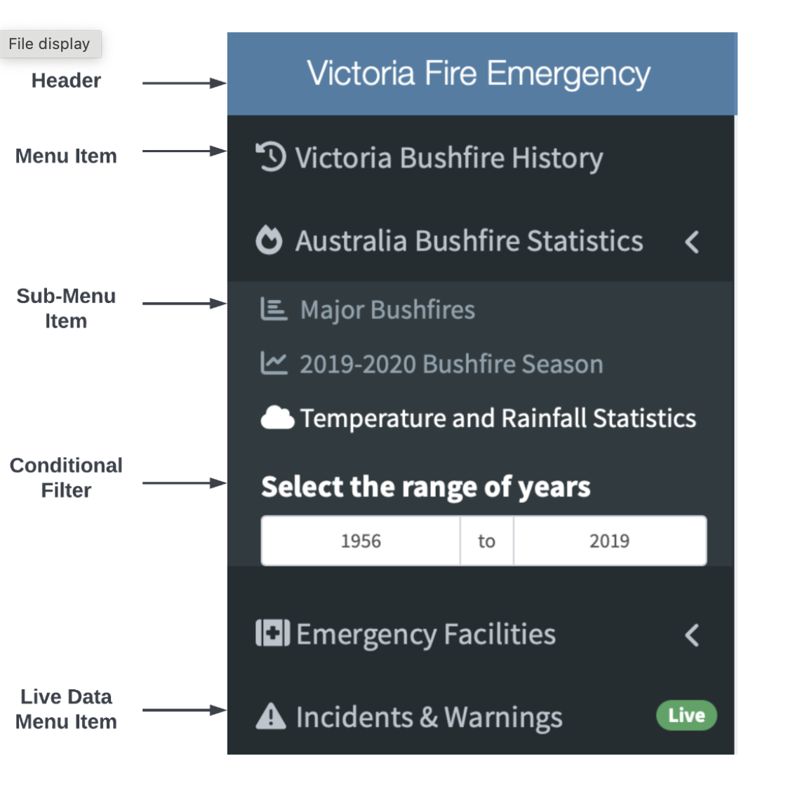

# Victoria Fire Emergency

# Dashboard

## Project in R & Shiny

## 1 Introduction

The "Victoria Fire Emergency" combines various historical and live data to present a single-
stop dashboard where a user can learn about the history of bushfires in Australia, specifically
in Victoria. The dashboard displays maps for different emergency facilities in Victoria. It
also accumulates and shows live incident reports and fire warnings currently issued by the
state of Victoria. This dashboard will be helpful to people in case of emergencies and for
analyzing various trends related to bushfires in Australia.

## 2 Design Summary

The dashboard has several menu items on the left side of the page that can navigate 
toward different maps and charts. Some menu items like "Australia Bushfire Statistics" and
"Emergency Facilities" has sub-menu items that expand upon clicking. Few menu items
offer filter functionality which will be displayed conditionally on the sidebar based on the
navigation of the menu items. Filters on the sidebar apply to all the charts in the view.
Maps have the "locate me" feature on the top-right side, to locate the current location of
the user and also a "search" feature to search locations on the map.

## 3 Appendix

1. 50 years of bushfires in Victoria: The bushfire history polygon shape-file was
    downloaded and converted into raster in ArcGIS Pro software to reduce the load on dash-
    board and then leaflet library was used to display the raster data after aggregating the
    points further [2].
2. Bushfires in Victoria - Data: The table data was scraped from Wikipedia using
    the rvest library and then displayed in shiny using the DT library [7].
3. Major Bushfires in Australia: The bushfires in Australia data was acquired from
    open API using the jsonlite package and then plotted on the user interface using the
    ggplot and plotly package [6].
4. 2019-2020 bushfires in Australia: The statistics were acquired from open API
    and column names and date columns were formatted. It was then plotted on the user
    interface using the ggplot and plotly package [6].
5. Temperature & Rainfall Statistics: The data was obtained from an open API and
    then year column was formatted as for filtering and then plotted on a time series chart
    using ggplot and plotly [6].
6. CFA District Boundaries and Locations: The CFA district boundaries data
    shape file was downloaded and then plotted on the map using the leaflet map [1]. Then
    locations of fire stations were downloaded as multi-point data and then converted to
    point data using the sf library [3]. Then it was plotted on the same map.
7. Neighbourhood Safer Places Map: The data was downloaded as a PDF file from
    Fire & Rescue Victoria website and converted into Excel format. The locations of the
    places were then geo-coded in bulk and then the CSV file was used to plot markers on
    the map using the leaflet library [4].
8. Hospitals in Victoria Map: The data was downloaded as a multi-point file and then
    converted to point data and the markers were plotted on the map while distinguishing
    different types of hospitals [3].
9. Live incidents in Victoria: The data was taken from open API which has all the
    information and the coordinates of the incidents. The incident markers were then
    plotted on the map using the leaflet library [5].
10. RSS Feeds of Fire Burns & Danger Ratings: The RSS data was taken from
the RSS link and converted into a data frame using the tidyRSS package. It was then
displayed as text on the user interface [5].

## References

[1] Country Fire Authority (CFA) District Boundaries - Vicmap Admin - Victorian Govern-
ment Data Directory — discover.data.vic.gov.au. https://discover.data.vic.gov.
au/dataset/country-fire-authority-cfa-district-boundaries-vicmap-admin.
[Accessed 25-Sep-2022].

[2] Fire history overlay of most recent fires - victorian govern-
ment data directory. https://discover.data.vic.gov.au/dataset/
fire-history-overlay-of-most-recent-fires.

[3] FOI - Point - Vicmap Features of Interest - Victorian Government Data Di-
rectory — discover.data.vic.gov.au. https://discover.data.vic.gov.au/dataset/
foi-point-vicmap-features-of-interest. [Accessed 25-Sep-2022].

[4] Neighbourhood Safer Places — cfa.vic.gov.au. https://www.cfa.vic.gov.au/
plan-prepare/your-local-area-info-and-advice/neighbourhood-safer-places.
[Accessed 25-Sep-2022].

[5] RSS Feeds — cfa.vic.gov.au.https://www.cfa.vic.gov.au/rss-feeds. [Accessed 25-
Sep-2022].

[6] Visualizing Australian Fires — australia-fire-api-dashboard.herokuapp.com. https://
australia-fire-api-dashboard.herokuapp.com/api/v1.0/docs. [Accessed 25-Sep-
2022].

[7] Wikipedia contributors. List of major bushfires in australia — Wikipedia, the
free encyclopedia. https://en.wikipedia.org/w/index.php?title=List_of_major_
bushfires_in_Australia&oldid=1109820864, 2022.

